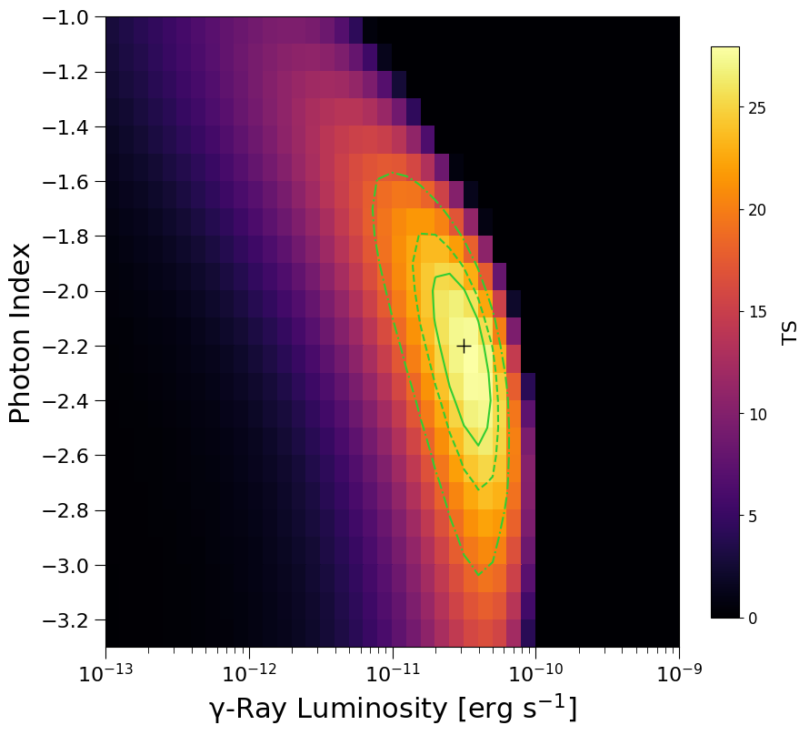
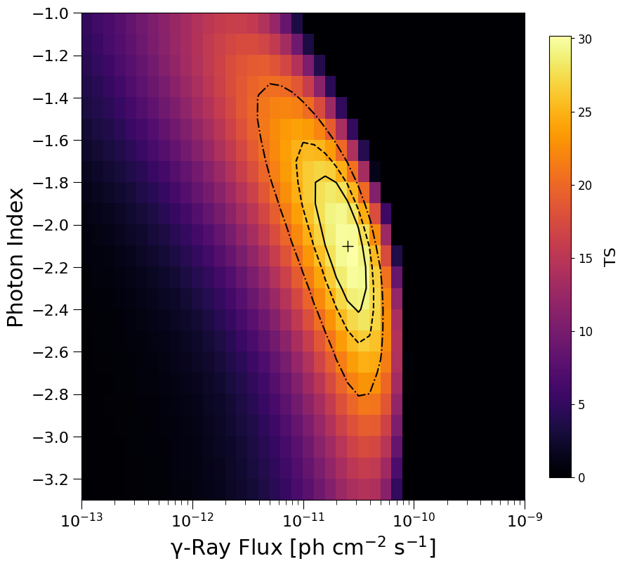

# UFO Analysis

The corresponding publication is available [here](https://iopscience.iop.org/article/10.3847/1538-4357/ac1bb2).  
Energy: 1 - 800 GeV  
Time: 239557417 - 589820845  

## Standard Analysis

max TS = 27.9 (sigma = 4.9)  
best index = 2.2 +/- 0.3  
best flux = (3.16, +1.85, -1.17)e-11 ph/cm^2/s  

## Joint-Likelihood Analysis

max TS = 30.1 (sigma = 5.1)  
best index = 2.1 +/- 0.3  
best flux = (2.51, +1.47, -0.93)e-11 ph/cm^2/s  
